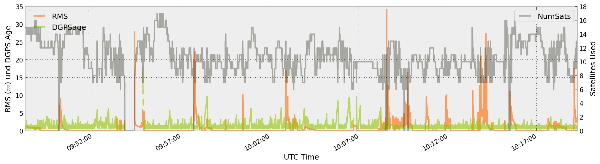
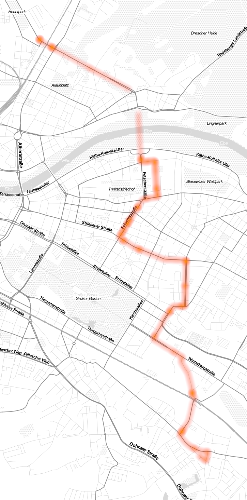

Pandas-NMEA
===========

Parse NMEA Sentences with Python Pandas

Turns this

```
$GPGGA,094814.40,5104.6852091,N,01345.1067321,E,5,15,0.95,130.7952,M,43.8438,M,1.4,0548*7F
$GNGST,094814.40,1.194,0.250,0.027,145.728,0.208,0.143,1.167*42
$GPGGA,094814.50,5104.6852077,N,01345.1067351,E,5,15,0.95,130.7811,M,43.8438,M,1.5,0548*76
$GNGST,094814.50,1.198,0.251,0.027,145.728,0.208,0.143,1.171*49
$GPGGA,094814.60,5104.6852059,N,01345.1067367,E,5,15,0.95,130.7693,M,43.8438,M,1.6,0548*7B
$GNGST,094814.60,1.201,0.252,0.028,145.728,0.209,0.144,1.174*46
$GPGGA,094814.70,5104.6852050,N,01345.1067398,E,5,15,0.95,130.7682,M,43.8438,M,0.7,0548*73
$GNGST,094814.70,1.165,0.244,0.027,145.737,0.203,0.139,1.138*48
```

into this



and with the help of [heatmap](http://sethoscope.net/heatmap/) and [OSMViz](http://cbick.github.io/osmviz/html/index.html) to this



`Map tiles by Stamen Design, under CC BY 3.0. Data by OpenStreetMap, under CC BY SA.`


#### Take a look at the [IPython Notebook](http://nbviewer.ipython.org/github/balzer82/Pandas-NMEA/blob/master/NMEAparser.ipynb)
